# 2. Analysis

**EasyTrade - 모의 주식거래 앱**

| Student No. | 22110926 |
|---|---|
| Name | 이호준 |
| E-mail | min7779912@naver.com |

---

## [ Revision history ]

| Revision date | Version # | Description | Author |
|---|---:|---|---|
| 2026.05.02 | 1.0.0 | First Draft | 이호준 |
| 2026.05.06 | 1.1.0 | 예시 문서 양식에 맞게 Use case analysis, Domain analysis, User Interface prototype 수정 | 이호준 |

---

## = Contents =

1. Introduction
2. Use case analysis
   - 2.1 Use case diagram
   - 2.2 Use case description
3. Domain analysis
4. User Interface prototype
5. Glossary
6. References

---

# 1. Introduction

## 1) Summary

최근 주식 시장에 대한 관심이 증가하면서 주식 투자를 처음 시작하려는 사람들도 많아지고 있다. 하지만 초보 투자자가 충분한 경험 없이 실제 돈으로 바로 투자하면 손실을 볼 위험이 크다. 특히 주식의 현재가를 확인하고, 매수와 매도를 결정하고, 보유 종목의 손익을 확인하는 과정은 처음 접하는 사용자에게 어렵게 느껴질 수 있다.

EasyTrade는 이러한 문제를 해결하기 위해 고안한 모의 주식거래 앱이다. 사용자는 실제 돈이 아닌 가상 자금을 이용하여 주식 시세 조회, 매수, 매도, 포트폴리오 조회를 경험할 수 있다. 이를 통해 사용자는 금전적 부담 없이 주식 거래의 기본 흐름을 이해하고, 자신의 투자 결과를 확인할 수 있다.

## 2) Introduce "EasyTrade"

EasyTrade는 초보 투자자를 대상으로 하는 모의 주식거래 시스템이다. 사용자는 먼저 회원가입을 통해 계정을 만들고, 로그인 후 기본 가상 자금 10,000,000원을 지급받는다. 이후 사용자는 종목명 또는 종목 코드를 검색하여 주식의 현재가를 확인하고, 원하는 수량만큼 주식을 매수하거나 보유 중인 주식을 매도할 수 있다.

시스템은 외부 주식 시세 API를 이용하여 실제 시장과 유사한 가격 정보를 제공한다. 사용자의 계정 정보, 가상 잔액, 보유 종목, 거래 내역은 데이터베이스에 저장된다. 또한 포트폴리오 화면에서는 사용자가 보유한 종목, 보유 수량, 평균 매수가, 현재 평가 금액을 확인할 수 있다.

EasyTrade의 기본 기능은 회원가입, 로그인, 주식 시세 조회, 주식 매수, 주식 매도, 포트폴리오 조회이다. 추가 기능으로는 주식 차트 조회, 관심 종목 관리, 거래량 및 상승률 순위 조회, 거래 내역 조회, 수익률 분석을 고려한다.

## 3) Goal

EasyTrade의 첫 번째 목표는 주식 투자 입문자가 실제 금전적 손실 없이 주식 거래 과정을 연습할 수 있는 환경을 제공하는 것이다. 사용자는 가상 자금을 사용하기 때문에 투자 실패에 대한 부담 없이 여러 종목을 매수하거나 매도해볼 수 있다.

두 번째 목표는 초보자도 이해하기 쉬운 화면과 기능을 제공하는 것이다. 매수와 매도 과정에서는 현재가, 수량, 총 거래 금액을 명확하게 보여주고, 포트폴리오에서는 가상 잔액과 보유 종목을 한눈에 확인할 수 있도록 한다.

세 번째 목표는 실제 주식 시세와 유사한 데이터를 활용하여 모의 거래의 현실감을 높이는 것이다. 이를 위해 한국투자증권 Open API와 같은 실제 사용 가능한 주식 API를 기준으로 시스템을 설계한다.

---

# 2. Use case analysis

## 2.1 Use case diagram

아래의 그림은 EasyTrade 시스템의 Use Case Diagram을 나타낸 것이다.

Conceptualization Document에서 정의한 Use Case List를 바탕으로 위와 같은 Use Case Diagram을 도출하였다. 주 Actor는 User이다. Stock Price API는 사용자가 직접 실행하는 기능이 아니라, 주식 시세가 필요한 기능에서 시스템이 내부적으로 포함하여 사용하는 외부 서비스이다.

아래는 각 Use Case의 ID와 Korean Name, Actor를 나타낸 표이다.

| Use Case Name | Use Case ID | Korean Name | Actor |
|---|---:|---|---|
| Register | #1 | 회원가입 | User |
| Login | #2 | 로그인 | User |
| View Stock Price | #3 | 주식 시세 조회 | User, Stock Price API |
| Buy Stock | #4 | 주식 매수 | User |
| Sell Stock | #5 | 주식 매도 | User |
| View Portfolio | #6 | 포트폴리오 조회 | User |
| View Stock Chart | #7 | 주식 차트 조회 | User, Stock Price API |
| Manage Watchlist | #8 | 관심 종목 관리 | User |
| View Stock Ranking | #9 | 주식 순위 조회 | User, Stock Price API |
| View Trade History | #10 | 거래 내역 조회 | User |
| Analyze Return | #11 | 수익률 분석 | User |

Stock Price API와의 연결은 Use Case Diagram의 include 관계에서 표현한다. 예를 들어 Buy Stock, Sell Stock, View Portfolio, Manage Watchlist, Analyze Return 기능은 사용자가 실행하지만, 내부적으로 현재가가 필요할 때 View Stock Price 또는 Fetch Stock API 기능을 포함한다.

Use Case Description에서는 위에서부터 차례대로 각 Use Case에 대해 표로 Description을 보여줄 것이다.

## 2.2 Use case description

### Use Case #1 : Register

**GENERAL CHARACTERISTICS**

| 항목 | 내용 |
|---|---|
| Summary | 사용자가 EasyTrade를 처음 이용하기 위해 회원가입을 하는 기능 |
| Scope | EasyTrade |
| Level | User Level |
| Author | 이호준 |
| Last Update | 2026.05.06 |
| Status | Analysis |
| Primary Actor | User |
| Preconditions | EasyTrade 앱이 실행되어 있어야 한다. |
| Trigger | 사용자가 로그인 화면에서 회원가입 버튼을 누를 때 |
| Success Post Condition | 사용자 계정이 생성되고 기본 가상 자금이 지급된다. |
| Failed Post Condition | 사용자 계정이 생성되지 않는다. |

**MAIN SUCCESS SCENARIO**

| Step | Action |
|---:|---|
| 1 | 사용자는 로그인 화면에서 회원가입 버튼을 누른다. |
| 2 | 시스템은 회원가입 화면을 보여준다. |
| 3 | 사용자는 이름, 이메일, 비밀번호, 닉네임을 입력한다. |
| 4 | 사용자는 회원가입 완료 버튼을 누른다. |
| 5 | 시스템은 입력값이 비어 있지 않은지 확인한다. |
| 6 | 시스템은 이메일이 이미 등록되어 있는지 확인한다. |
| 7 | 시스템은 사용자 계정을 생성한다. |
| 8 | 시스템은 신규 사용자에게 기본 가상 자금 10,000,000원을 지급한다. |
| 9 | 시스템은 회원가입 성공 메시지를 보여주고 로그인 화면으로 이동한다. |

**EXTENSION SCENARIOS**

| Step | Branching Action |
|---:|---|
| 5 | 5a. 필수 입력값이 비어 있는 경우 5a.1. 시스템은 비어 있는 항목을 입력하라는 메시지를 보여준다. 5a.2. 회원가입 화면으로 돌아간다. |
| 6 | 6a. 이미 등록된 이메일인 경우 6a.1. 시스템은 이미 사용 중인 이메일이라는 메시지를 보여준다. 6a.2. 이메일 입력 단계로 돌아간다. |

**RELATED INFORMATION**

| 항목 | 내용 |
|---|---|
| Performance | <= 3 Seconds |
| Frequency | 사용자당 1회 |
| Concurrency | No Limits |
| Due Date | 2026.05.31 |

### Use Case #2 : Login

**GENERAL CHARACTERISTICS**

| 항목 | 내용 |
|---|---|
| Summary | 등록된 사용자가 이메일과 비밀번호로 인증을 받는 기능 |
| Scope | EasyTrade |
| Level | User Level |
| Author | 이호준 |
| Last Update | 2026.05.06 |
| Status | Analysis |
| Primary Actor | User |
| Preconditions | 사용자는 EasyTrade에 회원가입이 되어 있어야 한다. |
| Trigger | 사용자가 이메일과 비밀번호를 입력하고 로그인 버튼을 누를 때 |
| Success Post Condition | 사용자는 로그인에 성공하여 EasyTrade의 기능을 사용할 수 있다. |
| Failed Post Condition | 사용자는 로그인에 실패하고 로그인 화면에 머무른다. |

**MAIN SUCCESS SCENARIO**

| Step | Action |
|---:|---|
| 1 | 사용자는 로그인 화면에서 이메일과 비밀번호를 입력한다. |
| 2 | 사용자는 로그인 버튼을 누른다. |
| 3 | 시스템은 입력된 이메일로 사용자 정보를 조회한다. |
| 4 | 시스템은 입력된 비밀번호가 저장된 비밀번호와 일치하는지 확인한다. |
| 5 | 시스템은 로그인 성공 메시지를 보여주고 홈 화면으로 이동한다. |

**EXTENSION SCENARIOS**

| Step | Branching Action |
|---:|---|
| 1 | 1a. 이메일 또는 비밀번호가 비어 있는 경우 1a.1. 시스템은 이메일과 비밀번호를 입력하라는 메시지를 보여준다. 1a.2. 로그인 화면으로 돌아간다. |
| 3 | 3a. 등록되지 않은 이메일인 경우 3a.1. 시스템은 등록되지 않은 사용자라는 메시지를 보여준다. 3a.2. 로그인 화면으로 돌아간다. |
| 4 | 4a. 비밀번호가 일치하지 않는 경우 4a.1. 시스템은 비밀번호가 올바르지 않다는 메시지를 보여준다. 4a.2. 비밀번호 입력칸을 초기화한다. |

**RELATED INFORMATION**

| 항목 | 내용 |
|---|---|
| Performance | <= 3 Seconds |
| Frequency | 사용자당 하루 평균 1~3회 |
| Concurrency | No Limits |
| Due Date | 2026.05.31 |

### Use Case #3 : View Stock Price

**GENERAL CHARACTERISTICS**

| 항목 | 내용 |
|---|---|
| Summary | 사용자가 종목명 또는 종목 코드로 주식 현재가를 조회하는 기능 |
| Scope | EasyTrade |
| Level | User Level |
| Author | 이호준 |
| Last Update | 2026.05.06 |
| Status | Analysis |
| Primary Actor | User |
| Secondary Actor | Stock Price API |
| Preconditions | 사용자는 로그인되어 있어야 하며 외부 주식 시세 API와 통신 가능해야 한다. |
| Trigger | 사용자가 검색창에 종목명 또는 종목 코드를 입력하고 검색 버튼을 누를 때 |
| Success Post Condition | 사용자는 조회한 종목의 현재가를 확인할 수 있다. |
| Failed Post Condition | 사용자는 종목 가격 정보를 확인할 수 없다. |

**MAIN SUCCESS SCENARIO**

| Step | Action |
|---:|---|
| 1 | 사용자는 주식 검색 화면에서 종목명 또는 종목 코드를 입력한다. |
| 2 | 사용자는 검색 버튼을 누른다. |
| 3 | 시스템은 입력된 검색어가 비어 있지 않은지 확인한다. |
| 4 | 시스템은 외부 주식 시세 API에 종목 정보를 요청한다. |
| 5 | 외부 주식 시세 API는 해당 종목의 현재가 정보를 반환한다. |
| 6 | 시스템은 종목명, 종목 코드, 현재가, 전일 대비 정보를 화면에 보여준다. |

**EXTENSION SCENARIOS**

| Step | Branching Action |
|---:|---|
| 3 | 3a. 검색어가 비어 있는 경우 3a.1. 시스템은 종목명 또는 종목 코드를 입력하라는 메시지를 보여준다. 3a.2. 검색 화면으로 돌아간다. |
| 4 | 4a. 외부 API 서버와 통신할 수 없는 경우 4a.1. 시스템은 시세 정보를 불러올 수 없다는 메시지를 보여준다. 4a.2. 검색 화면에 머무른다. |
| 5 | 5a. 검색한 종목이 존재하지 않는 경우 5a.1. 시스템은 검색 결과가 없다는 메시지를 보여준다. 5a.2. 검색 화면으로 돌아간다. |

**RELATED INFORMATION**

| 항목 | 내용 |
|---|---|
| Performance | <= 5 Seconds |
| Frequency | 사용자별 수시 사용 |
| Concurrency | No Limits |
| Due Date | 2026.05.31 |

### Use Case #4 : Buy Stock

**GENERAL CHARACTERISTICS**

| 항목 | 내용 |
|---|---|
| Summary | 사용자가 가상 자금을 이용하여 선택한 종목을 매수하는 기능 |
| Scope | EasyTrade |
| Level | User Level |
| Author | 이호준 |
| Last Update | 2026.05.06 |
| Status | Analysis |
| Primary Actor | User |
| Preconditions | 사용자는 로그인되어 있어야 하고 가상 잔액이 있어야 한다. |
| Trigger | 사용자가 주식 상세 화면에서 매수 버튼을 누를 때 |
| Success Post Condition | 가상 잔액이 차감되고 보유 종목에 매수한 주식이 추가된다. |
| Failed Post Condition | 매수 처리가 되지 않고 잔액과 보유 종목은 변경되지 않는다. |

**MAIN SUCCESS SCENARIO**

| Step | Action |
|---:|---|
| 1 | 사용자는 주식 상세 화면에서 매수 버튼을 누른다. |
| 2 | 시스템은 매수 화면을 보여준다. |
| 3 | 사용자는 매수할 수량을 입력한다. |
| 4 | 시스템은 외부 주식 시세 API에서 현재가를 가져온다. |
| 5 | 시스템은 현재가와 수량을 곱하여 총 매수 금액을 계산한다. |
| 6 | 시스템은 사용자의 가상 잔액이 충분한지 확인한다. |
| 7 | 사용자는 매수 예상 금액을 확인하고 매수 확인 버튼을 누른다. |
| 8 | 시스템은 사용자의 가상 잔액에서 총 매수 금액을 차감한다. |
| 9 | 시스템은 사용자의 보유 종목에 해당 종목과 수량을 추가한다. |
| 10 | 시스템은 거래 내역에 매수 기록을 저장한다. |

**EXTENSION SCENARIOS**

| Step | Branching Action |
|---:|---|
| 3 | 3a. 수량이 입력되지 않았거나 0 이하인 경우 3a.1. 시스템은 1주 이상 입력하라는 메시지를 보여준다. 3a.2. 매수 화면으로 돌아간다. |
| 4 | 4a. 현재가 조회에 실패한 경우 4a.1. 시스템은 현재가를 불러올 수 없다는 메시지를 보여준다. 4a.2. 매수 처리를 중단한다. |
| 6 | 6a. 가상 잔액이 부족한 경우 6a.1. 시스템은 잔액이 부족하다는 메시지를 보여준다. 6a.2. 잔액과 보유 종목을 변경하지 않는다. |

**RELATED INFORMATION**

| 항목 | 내용 |
|---|---|
| Performance | <= 5 Seconds |
| Frequency | 사용자별 수시 사용 |
| Concurrency | 동일 사용자의 동시 거래 요청은 순서대로 처리해야 한다. |
| Due Date | 2026.05.31 |

### Use Case #5 : Sell Stock

**GENERAL CHARACTERISTICS**

| 항목 | 내용 |
|---|---|
| Summary | 사용자가 보유 중인 주식을 현재가 기준으로 매도하는 기능 |
| Scope | EasyTrade |
| Level | User Level |
| Author | 이호준 |
| Last Update | 2026.05.06 |
| Status | Analysis |
| Primary Actor | User |
| Preconditions | 사용자는 로그인되어 있어야 하고 매도하려는 종목을 보유하고 있어야 한다. |
| Trigger | 사용자가 보유 종목 또는 주식 상세 화면에서 매도 버튼을 누를 때 |
| Success Post Condition | 보유 수량이 감소하고 매도 금액이 가상 잔액에 추가된다. |
| Failed Post Condition | 매도 처리가 되지 않고 잔액과 보유 수량은 변경되지 않는다. |

**MAIN SUCCESS SCENARIO**

| Step | Action |
|---:|---|
| 1 | 사용자는 포트폴리오 또는 주식 상세 화면에서 매도 버튼을 누른다. |
| 2 | 시스템은 매도 화면을 보여준다. |
| 3 | 사용자는 매도할 수량을 입력한다. |
| 4 | 시스템은 사용자가 해당 종목을 보유하고 있는지 확인한다. |
| 5 | 시스템은 보유 수량이 매도 수량보다 크거나 같은지 확인한다. |
| 6 | 시스템은 외부 주식 시세 API에서 현재가를 가져온다. |
| 7 | 시스템은 현재가와 수량을 곱하여 총 매도 금액을 계산한다. |
| 8 | 사용자는 매도 예상 금액을 확인하고 매도 확인 버튼을 누른다. |
| 9 | 시스템은 보유 수량을 매도 수량만큼 차감한다. |
| 10 | 시스템은 총 매도 금액을 사용자의 가상 잔액에 추가한다. |
| 11 | 시스템은 거래 내역에 매도 기록을 저장한다. |

**EXTENSION SCENARIOS**

| Step | Branching Action |
|---:|---|
| 3 | 3a. 수량이 입력되지 않았거나 0 이하인 경우 3a.1. 시스템은 1주 이상 입력하라는 메시지를 보여준다. 3a.2. 매도 화면으로 돌아간다. |
| 4 | 4a. 사용자가 해당 종목을 보유하고 있지 않은 경우 4a.1. 시스템은 보유하지 않은 종목이라는 메시지를 보여준다. 4a.2. 매도 처리를 중단한다. |
| 5 | 5a. 매도 수량이 보유 수량보다 많은 경우 5a.1. 시스템은 보유 수량이 부족하다는 메시지를 보여준다. 5a.2. 매도 화면으로 돌아간다. |
| 6 | 6a. 현재가 조회에 실패한 경우 6a.1. 시스템은 현재가를 불러올 수 없다는 메시지를 보여준다. 6a.2. 매도 처리를 중단한다. |

**RELATED INFORMATION**

| 항목 | 내용 |
|---|---|
| Performance | <= 5 Seconds |
| Frequency | 사용자별 수시 사용 |
| Concurrency | 동일 사용자의 동시 거래 요청은 순서대로 처리해야 한다. |
| Due Date | 2026.05.31 |

### Use Case #6 : View Portfolio

**GENERAL CHARACTERISTICS**

| 항목 | 내용 |
|---|---|
| Summary | 사용자가 자신의 가상 잔액, 보유 종목, 평균 매수가, 평가 금액을 확인하는 기능 |
| Scope | EasyTrade |
| Level | User Level |
| Author | 이호준 |
| Last Update | 2026.05.06 |
| Status | Analysis |
| Primary Actor | User |
| Preconditions | 사용자는 로그인되어 있어야 한다. |
| Trigger | 사용자가 포트폴리오 메뉴를 선택할 때 |
| Success Post Condition | 사용자는 현재 투자 현황을 확인할 수 있다. |
| Failed Post Condition | 포트폴리오 정보를 확인할 수 없다. |

**MAIN SUCCESS SCENARIO**

| Step | Action |
|---:|---|
| 1 | 사용자는 포트폴리오 버튼을 누른다. |
| 2 | 시스템은 사용자의 가상 잔액 정보를 조회한다. |
| 3 | 시스템은 사용자의 보유 종목 목록을 조회한다. |
| 4 | 시스템은 각 보유 종목의 현재가를 외부 주식 시세 API에서 가져온다. |
| 5 | 시스템은 종목별 평가 금액과 평가 손익을 계산한다. |
| 6 | 시스템은 가상 잔액, 보유 종목, 평균 매수가, 평가 금액, 총 자산을 화면에 보여준다. |

**EXTENSION SCENARIOS**

| Step | Branching Action |
|---:|---|
| 3 | 3a. 보유 종목이 없는 경우 3a.1. 시스템은 보유 종목이 없다는 안내를 보여준다. 3a.2. 가상 잔액만 표시한다. |
| 4 | 4a. 일부 종목의 현재가 조회에 실패한 경우 4a.1. 시스템은 조회 가능한 종목만 평가 금액을 계산한다. 4a.2. 조회 실패 종목은 현재가를 표시할 수 없다고 안내한다. |

**RELATED INFORMATION**

| 항목 | 내용 |
|---|---|
| Performance | <= 5 Seconds |
| Frequency | 사용자별 수시 사용 |
| Concurrency | No Limits |
| Due Date | 2026.05.31 |

### Use Case #7 : View Stock Chart

**GENERAL CHARACTERISTICS**

| 항목 | 내용 |
|---|---|
| Summary | 사용자가 선택한 종목의 기간별 가격 흐름을 차트로 확인하는 기능 |
| Scope | EasyTrade |
| Level | User Level |
| Author | 이호준 |
| Last Update | 2026.05.06 |
| Status | Analysis |
| Primary Actor | User |
| Secondary Actor | Stock Price API |
| Preconditions | 사용자는 로그인되어 있어야 하며 차트 데이터를 조회할 수 있어야 한다. |
| Trigger | 사용자가 주식 상세 화면에서 차트 기간을 선택할 때 |
| Success Post Condition | 사용자는 선택한 종목의 가격 흐름을 선 차트로 확인할 수 있다. |
| Failed Post Condition | 차트가 표시되지 않는다. |

**MAIN SUCCESS SCENARIO**

| Step | Action |
|---:|---|
| 1 | 사용자는 주식 상세 화면으로 이동한다. |
| 2 | 사용자는 1일, 1주, 1개월, 3개월 중 원하는 기간을 선택한다. |
| 3 | 시스템은 선택한 기간과 종목 코드로 외부 API에 차트 데이터를 요청한다. |
| 4 | 외부 API는 기간별 가격 데이터를 반환한다. |
| 5 | 시스템은 반환된 데이터를 선 차트 형태로 변환한다. |
| 6 | 시스템은 주식 상세 화면에 차트를 표시한다. |

**EXTENSION SCENARIOS**

| Step | Branching Action |
|---:|---|
| 2 | 2a. 사용자가 기간을 선택하지 않은 경우 2a.1. 시스템은 기본 기간인 1개월 차트를 표시한다. |
| 3 | 3a. 외부 API 요청에 실패한 경우 3a.1. 시스템은 차트 정보를 불러올 수 없다는 메시지를 보여준다. 3a.2. 주식 상세 화면에 머무른다. |
| 4 | 4a. 차트 데이터가 비어 있는 경우 4a.1. 시스템은 표시할 차트 데이터가 없다는 메시지를 보여준다. |

**RELATED INFORMATION**

| 항목 | 내용 |
|---|---|
| Performance | <= 5 Seconds |
| Frequency | 사용자별 수시 사용 |
| Concurrency | No Limits |
| Due Date | 2026.05.31 |

### Use Case #8 : Manage Watchlist

**GENERAL CHARACTERISTICS**

| 항목 | 내용 |
|---|---|
| Summary | 사용자가 관심 있는 종목을 등록하고 목록으로 확인하는 기능 |
| Scope | EasyTrade |
| Level | User Level |
| Author | 이호준 |
| Last Update | 2026.05.06 |
| Status | Analysis |
| Primary Actor | User |
| Preconditions | 사용자는 로그인되어 있어야 한다. |
| Trigger | 사용자가 주식 상세 화면에서 관심 종목 추가 버튼을 누르거나 관심 종목 화면을 열 때 |
| Success Post Condition | 사용자의 관심 종목 목록이 추가, 삭제 또는 조회된다. |
| Failed Post Condition | 관심 종목 목록이 변경되지 않는다. |

**MAIN SUCCESS SCENARIO**

| Step | Action |
|---:|---|
| 1 | 사용자는 주식 상세 화면에서 관심 종목 추가 버튼을 누른다. |
| 2 | 시스템은 해당 종목이 이미 관심 종목에 등록되어 있는지 확인한다. |
| 3 | 시스템은 해당 종목을 관심 종목 목록에 추가한다. |
| 4 | 사용자는 관심 종목 화면으로 이동한다. |
| 5 | 시스템은 사용자의 관심 종목 목록을 조회한다. |
| 6 | 시스템은 각 관심 종목의 현재가를 외부 API에서 가져온다. |
| 7 | 시스템은 관심 종목명, 종목 코드, 현재가, 등락률을 화면에 보여준다. |

**EXTENSION SCENARIOS**

| Step | Branching Action |
|---:|---|
| 2 | 2a. 이미 등록된 관심 종목인 경우 2a.1. 시스템은 이미 관심 종목에 등록되어 있다는 메시지를 보여준다. |
| 3 | 3a. 관심 종목 저장 중 오류가 발생한 경우 3a.1. 시스템은 관심 종목 추가에 실패했다는 메시지를 보여준다. |
| 5 | 5a. 관심 종목이 없는 경우 5a.1. 시스템은 관심 종목이 없다는 안내를 보여준다. |
| 6 | 6a. 일부 종목의 현재가 조회에 실패한 경우 6a.1. 시스템은 조회 가능한 종목의 시세만 표시한다. |

**RELATED INFORMATION**

| 항목 | 내용 |
|---|---|
| Performance | <= 5 Seconds |
| Frequency | 사용자별 수시 사용 |
| Concurrency | No Limits |
| Due Date | 2026.05.31 |

### Use Case #9 : View Stock Ranking

**GENERAL CHARACTERISTICS**

| 항목 | 내용 |
|---|---|
| Summary | 사용자가 거래량 상위, 상승률 상위, 하락률 상위 종목을 확인하는 기능 |
| Scope | EasyTrade |
| Level | User Level |
| Author | 이호준 |
| Last Update | 2026.05.06 |
| Status | Analysis |
| Primary Actor | User |
| Secondary Actor | Stock Price API |
| Preconditions | 사용자는 로그인되어 있어야 하며 외부 API에서 순위 정보를 조회할 수 있어야 한다. |
| Trigger | 사용자가 홈 화면 또는 순위 화면에서 순위 종류를 선택할 때 |
| Success Post Condition | 사용자는 선택한 기준의 주식 순위 목록을 확인할 수 있다. |
| Failed Post Condition | 순위 목록을 확인할 수 없다. |

**MAIN SUCCESS SCENARIO**

| Step | Action |
|---:|---|
| 1 | 사용자는 순위 화면으로 이동한다. |
| 2 | 사용자는 거래량 상위, 상승률 상위, 하락률 상위 중 하나를 선택한다. |
| 3 | 시스템은 선택한 순위 기준으로 외부 API에 순위 데이터를 요청한다. |
| 4 | 외부 API는 순위 종목 목록을 반환한다. |
| 5 | 시스템은 종목명, 종목 코드, 현재가, 등락률, 거래량을 정리한다. |
| 6 | 시스템은 순위 목록을 화면에 보여준다. |

**EXTENSION SCENARIOS**

| Step | Branching Action |
|---:|---|
| 2 | 2a. 사용자가 순위 기준을 선택하지 않은 경우 2a.1. 시스템은 기본값으로 거래량 상위 목록을 보여준다. |
| 3 | 3a. 외부 API 요청에 실패한 경우 3a.1. 시스템은 순위 정보를 불러올 수 없다는 메시지를 보여준다. |
| 4 | 4a. 순위 데이터가 비어 있는 경우 4a.1. 시스템은 표시할 순위 정보가 없다는 메시지를 보여준다. |

**RELATED INFORMATION**

| 항목 | 내용 |
|---|---|
| Performance | <= 5 Seconds |
| Frequency | 사용자별 수시 사용 |
| Concurrency | No Limits |
| Due Date | 2026.05.31 |

### Use Case #10 : View Trade History

**GENERAL CHARACTERISTICS**

| 항목 | 내용 |
|---|---|
| Summary | 사용자가 자신의 매수와 매도 거래 기록을 확인하는 기능 |
| Scope | EasyTrade |
| Level | User Level |
| Author | 이호준 |
| Last Update | 2026.05.06 |
| Status | Analysis |
| Primary Actor | User |
| Preconditions | 사용자는 로그인되어 있어야 한다. |
| Trigger | 사용자가 거래 내역 메뉴를 선택할 때 |
| Success Post Condition | 사용자는 자신의 과거 거래 내역을 확인할 수 있다. |
| Failed Post Condition | 거래 내역을 확인할 수 없다. |

**MAIN SUCCESS SCENARIO**

| Step | Action |
|---:|---|
| 1 | 사용자는 거래 내역 버튼을 누른다. |
| 2 | 시스템은 로그인한 사용자의 거래 내역을 조회한다. |
| 3 | 시스템은 거래 일시, 거래 종류, 종목명, 수량, 거래 가격, 거래 금액을 정리한다. |
| 4 | 시스템은 최신 거래가 위에 오도록 거래 내역을 정렬한다. |
| 5 | 시스템은 거래 내역 목록을 화면에 보여준다. |

**EXTENSION SCENARIOS**

| Step | Branching Action |
|---:|---|
| 2 | 2a. 거래 내역이 없는 경우 2a.1. 시스템은 거래 내역이 없다는 안내를 보여준다. |
| 2 | 2b. 거래 내역 조회 오류가 발생한 경우 2b.1. 시스템은 거래 내역을 불러올 수 없다는 메시지를 보여준다. |

**RELATED INFORMATION**

| 항목 | 내용 |
|---|---|
| Performance | <= 3 Seconds |
| Frequency | 사용자별 수시 사용 |
| Concurrency | No Limits |
| Due Date | 2026.05.31 |

### Use Case #11 : Analyze Return

**GENERAL CHARACTERISTICS**

| 항목 | 내용 |
|---|---|
| Summary | 사용자가 자신의 총 자산, 평가 손익, 종목별 수익률을 확인하는 기능 |
| Scope | EasyTrade |
| Level | User Level |
| Author | 이호준 |
| Last Update | 2026.05.06 |
| Status | Analysis |
| Primary Actor | User |
| Preconditions | 사용자는 로그인되어 있어야 하며 보유 종목과 현재가를 조회할 수 있어야 한다. |
| Trigger | 사용자가 수익률 분석 화면을 열 때 |
| Success Post Condition | 사용자는 현재 투자 결과와 수익률을 확인할 수 있다. |
| Failed Post Condition | 수익률 정보를 확인할 수 없다. |

**MAIN SUCCESS SCENARIO**

| Step | Action |
|---:|---|
| 1 | 사용자는 수익률 분석 화면으로 이동한다. |
| 2 | 시스템은 사용자의 가상 잔액과 보유 종목 목록을 조회한다. |
| 3 | 시스템은 각 보유 종목의 평균 매수가와 보유 수량을 조회한다. |
| 4 | 시스템은 외부 API에서 각 보유 종목의 현재가를 가져온다. |
| 5 | 시스템은 종목별 매수 금액, 평가 금액, 평가 손익을 계산한다. |
| 6 | 시스템은 종목별 수익률과 전체 수익률을 계산한다. |
| 7 | 시스템은 총 자산, 평가 손익, 전체 수익률, 종목별 수익률을 화면에 보여준다. |

**EXTENSION SCENARIOS**

| Step | Branching Action |
|---:|---|
| 2 | 2a. 보유 종목이 없는 경우 2a.1. 시스템은 분석할 보유 종목이 없다는 안내를 보여준다. 2a.2. 가상 잔액만 표시한다. |
| 4 | 4a. 현재가 조회에 실패한 종목이 있는 경우 4a.1. 시스템은 해당 종목의 수익률을 계산할 수 없다고 안내한다. |
| 5 | 5a. 평균 매수가 또는 수량 데이터가 올바르지 않은 경우 5a.1. 시스템은 수익률 계산을 중단하고 오류 메시지를 보여준다. |

**RELATED INFORMATION**

| 항목 | 내용 |
|---|---|
| Performance | <= 5 Seconds |
| Frequency | 사용자별 수시 사용 |
| Concurrency | No Limits |
| Due Date | 2026.05.31 |

---

# 3. Domain analysis

이 절에서는 EasyTrade 시스템에서 필요한 주요 class들을 설명한다. 실제 구현 단계의 세부 클래스까지 모두 정하는 것이 아니라, 시스템의 핵심 기능을 이해하는 데 필요한 도메인 class를 중심으로 정리하였다.

1) User

EasyTrade를 사용하는 회원 클래스이다. 사용자의 이름, 이메일, 비밀번호, 닉네임 정보를 가진다. 사용자는 회원가입 후 로그인하여 주식 시세 조회, 매수, 매도, 포트폴리오 조회 기능을 사용할 수 있다.

2) Portfolio

사용자의 투자 현황을 관리하는 클래스이다. 사용자의 가상 잔액, 보유 주식 목록, 총 자산 정보를 가진다. 사용자가 포트폴리오 화면을 열면 이 클래스의 정보를 바탕으로 현재 투자 상태를 보여준다.

3) Stock

거래 대상이 되는 주식 종목 클래스이다. 종목 코드, 종목명, 현재가, 등락률 정보를 가진다. 사용자는 Stock 정보를 검색하여 현재가를 확인하고, 해당 종목을 매수하거나 매도할 수 있다.

4) MyStock

사용자가 현재 보유하고 있는 주식 정보를 나타내는 클래스이다. 어떤 종목을 몇 주 가지고 있는지, 평균 매수가가 얼마인지 저장한다. 예를 들어 사용자가 Samsung Electronics를 10주 보유하고 있다면 그 정보가 MyStock에 저장된다.

5) Trade

사용자의 매수와 매도 기록을 저장하는 클래스이다. 거래 종류, 종목, 수량, 거래 가격, 거래 금액, 거래 시간을 가진다. 사용자가 주식을 매수하거나 매도하면 Trade 정보가 새로 생성된다.

6) Watchlist

사용자가 관심 있게 보는 종목을 저장하는 클래스이다. 사용자는 아직 매수하지 않은 종목이라도 Watchlist에 추가하여 나중에 쉽게 다시 확인할 수 있다.

7) StockPriceAPI

외부 주식 시세 API와 연결되는 클래스이다. EasyTrade는 이 클래스를 통해 주식의 현재가 정보를 가져온다. 주식 시세 조회, 매수, 매도, 포트폴리오 조회에서 현재가가 필요할 때 사용된다.

---

# 4. User Interface prototype

이 절에서는 EasyTrade 앱을 실제로 구현했을 때 나타나는 GUI prototype을 화면별로 설명한다. 각 화면은 Use Case Description에서 정의한 사용자 흐름을 기준으로 구성하였다.

## 1) Login

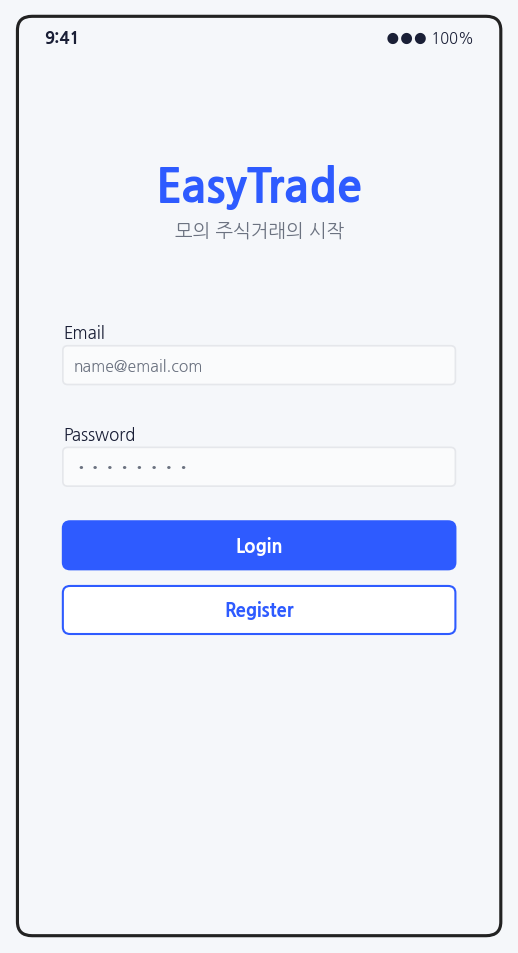

사용자가 EasyTrade를 실행하면 로그인 화면이 먼저 나타난다. 사용자는 이메일과 비밀번호를 입력하고 Login 버튼을 눌러 시스템에 접속한다. 계정이 없는 사용자는 Register 버튼을 눌러 회원가입 화면으로 이동한다.

## 2) Register

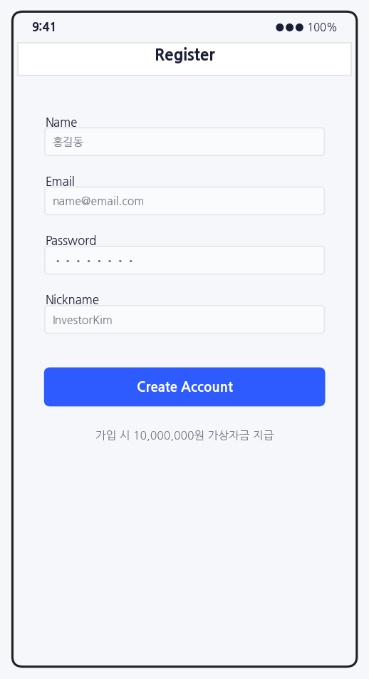

회원가입 화면에서는 이름, 이메일, 비밀번호, 닉네임을 입력한다. 회원가입에 성공하면 기본 가상 자금 10,000,000원이 지급되고 로그인 화면으로 이동한다. 이미 등록된 이메일을 입력하면 회원가입이 되지 않는다.

## 3) Home

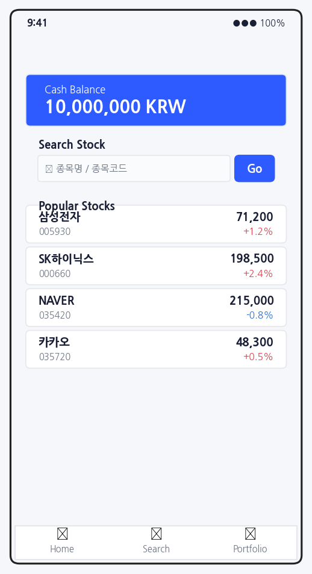

로그인에 성공하면 홈 화면이 출력된다. 사용자는 홈 화면에서 자신의 가상 잔액을 확인할 수 있고, 검색창을 통해 종목명이나 종목 코드를 입력하여 주식 시세를 조회할 수 있다.

## 4) Stock Search

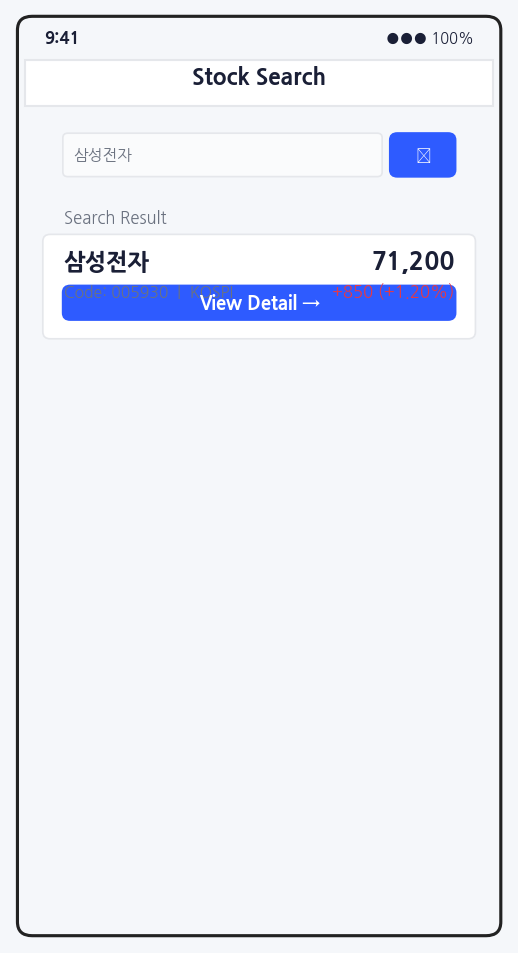

주식 검색 화면에서는 사용자가 종목명 또는 종목 코드를 입력한다. 검색이 성공하면 종목명, 종목 코드, 현재가가 화면에 출력된다. 검색 결과를 선택하면 주식 상세 화면으로 이동한다.

## 5) Stock Detail

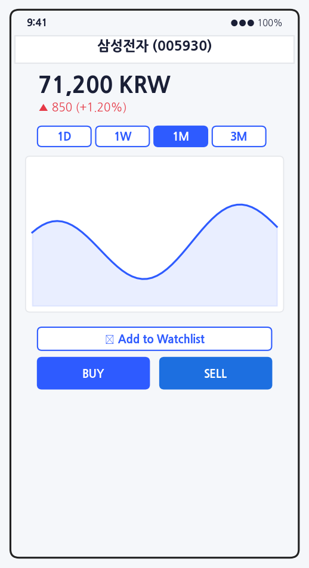

주식 상세 화면에서는 선택한 종목의 현재가와 등락률을 보여준다. 사용자는 기간 버튼을 눌러 주식 차트를 확인할 수 있고, 관심 종목으로 추가할 수도 있다. Buy 버튼을 누르면 매수 화면으로 이동하고 Sell 버튼을 누르면 매도 화면으로 이동한다.

## 6) Buy Stock

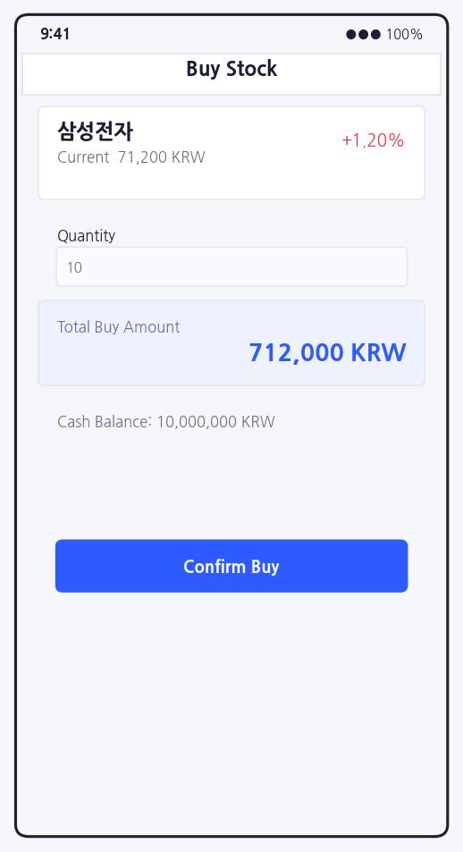

매수 화면에서 사용자는 매수할 수량을 입력한다. 시스템은 현재가와 수량을 곱해 총 매수 금액을 계산한다. 사용자의 가상 잔액이 충분하면 매수가 완료되고, 잔액이 부족하면 매수할 수 없다.

## 7) Sell Stock

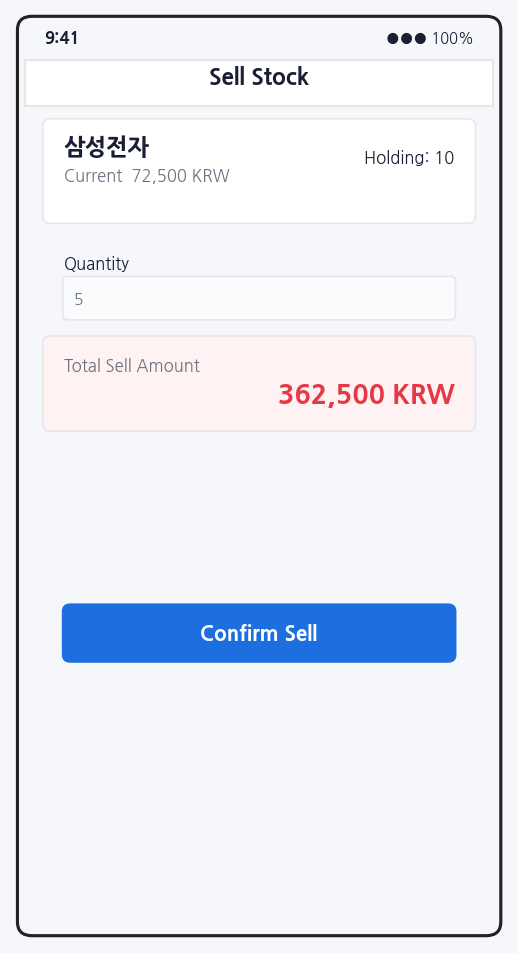

매도 화면에서 사용자는 매도할 수량을 입력한다. 시스템은 사용자가 해당 종목을 보유하고 있는지 확인하고, 입력한 수량이 보유 수량보다 많지 않은지 검사한다. 조건을 만족하면 매도 금액이 가상 잔액에 추가된다.

## 8) Portfolio

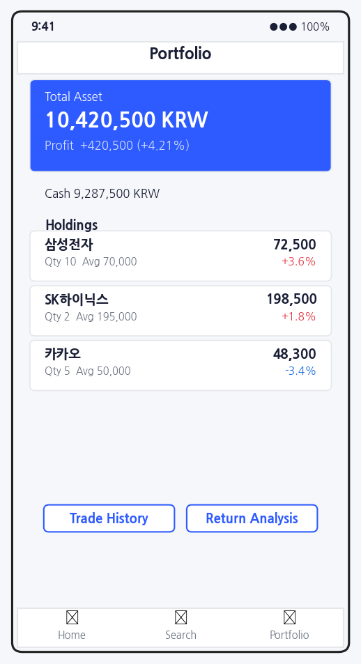

포트폴리오 화면에서는 사용자의 가상 잔액, 총 자산, 보유 종목, 평균 매수가, 현재가, 평가 손익을 보여준다. 보유 종목이 없으면 보유 종목이 없다는 안내를 보여준다.

## 9) Watchlist

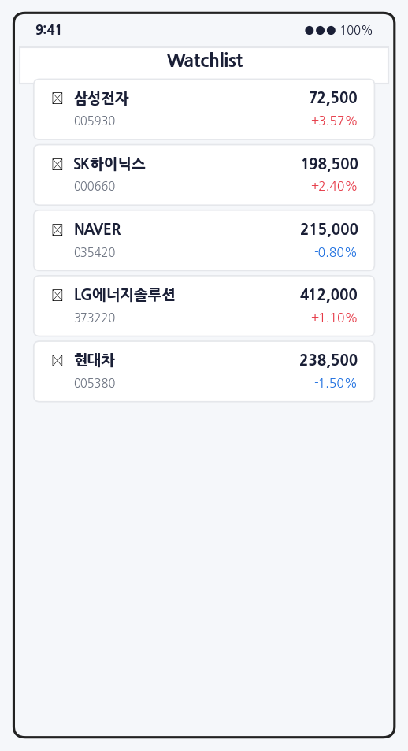

관심 종목 화면에서는 사용자가 저장한 관심 종목 목록을 보여준다. 사용자는 관심 종목을 선택하여 주식 상세 화면으로 이동할 수 있다.

## 10) Stock Ranking

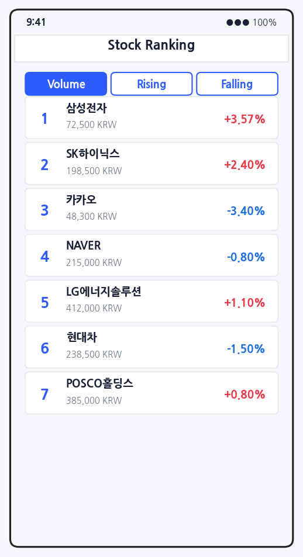

주식 순위 화면에서는 거래량 상위, 상승률 상위, 하락률 상위 종목을 보여준다. 사용자는 순위 목록에서 종목을 선택하여 상세 화면으로 이동할 수 있다.

## 11) Trade History

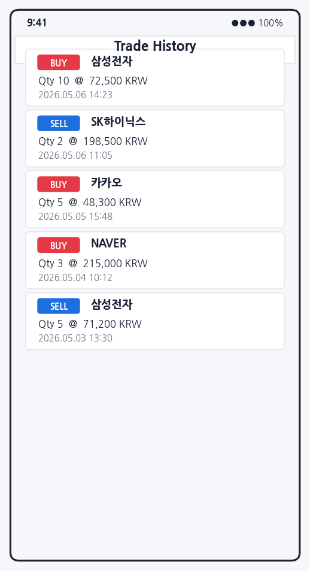

거래 내역 화면에서는 사용자의 매수와 매도 기록을 최신순으로 보여준다. 거래 내역에는 거래 종류, 종목명, 수량, 거래 가격, 거래 시간이 포함된다.

## 12) Return Analysis

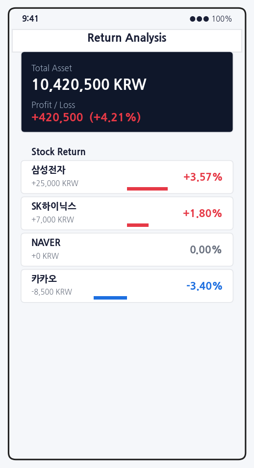

수익률 분석 화면에서는 사용자의 총 자산, 전체 평가 손익, 전체 수익률, 종목별 수익률을 보여준다. 사용자는 자신의 모의투자 결과가 이익인지 손실인지 쉽게 확인할 수 있다.

---

# 5. Glossary

| Terms | Description |
|---|---|
| EasyTrade | 가상 자금을 이용해 실제 주식 시장과 유사한 환경에서 매매를 연습할 수 있는 모의 주식거래 앱 |
| User | EasyTrade에 가입하여 주식 조회, 매수, 매도, 포트폴리오 조회 기능을 사용하는 사용자 |
| Register | 사용자가 EasyTrade 계정을 새로 생성하는 기능 |
| Login | 등록된 사용자가 이메일과 비밀번호로 인증을 받는 기능 |
| 가상 자금 | 실제 금전적 가치가 없는 모의 투자용 자금이다. 회원가입 시 기본 10,000,000원이 지급된다. |
| 주식 | 기업이 발행한 지분 단위이며 EasyTrade에서 매수와 매도의 대상이 된다. |
| 종목 코드 | 주식 종목을 구분하기 위한 고유 코드 |
| 현재가 | 외부 주식 시세 API에서 가져온 주식의 현재 가격 |
| 차트 | 일정 기간 동안의 주식 가격 흐름을 선으로 보여주는 화면 요소 |
| 관심 종목 | 사용자가 따로 저장하여 지속적으로 확인하고 싶은 종목 |
| 주식 순위 | 거래량, 상승률, 하락률 등의 기준으로 정렬한 종목 목록 |
| 매수 | 사용자가 가상 자금을 사용하여 주식을 구매하는 행위 |
| 매도 | 사용자가 보유한 주식을 판매하여 가상 자금으로 돌려받는 행위 |
| 보유 종목 | 사용자가 매수하여 현재 가지고 있는 주식 종목 |
| 평균 매수가 | 동일 종목을 여러 번 매수했을 때 계산되는 평균 구매 가격 |
| 포트폴리오 | 사용자의 가상 잔액, 보유 종목, 평가 금액, 손익 정보를 모아 보여주는 투자 현황 |
| 총 자산 | 가상 잔액과 보유 종목 평가 금액을 합한 값 |
| 거래 내역 | 사용자가 매수 또는 매도한 기록 |
| 수익률 | 매수 금액 대비 현재 평가 손익이 어느 정도인지 백분율로 나타낸 값 |
| 주식 시세 API | 주식의 현재가 정보를 제공하는 외부 API |
| 데이터베이스 | 사용자 정보, 가상 잔액, 보유 종목, 거래 내역을 저장하는 저장소 |

---

# 6. References

1. 한국투자증권 Open API: https://apiportal.koreainvestment.com
