# 3. Design

**EasyTrade - 모의 주식거래 앱**

| Student No. | 22110926 |
|---|---|
| Name | 이호준 |
| E-mail | min7779912@naver.com |

---

## [ Revision history ]

| Revision date | Version # | Description | Author |
|---|---:|---|---|
| 2026.06.05 | 1.0.0 | Conceptualization, Analysis 문서를 바탕으로 EasyTrade의 class diagram, sequence diagram, state machine diagram, implementation requirements를 작성함. | 이호준 |
| 2026.06.05 | 1.0.1 | 사진파일이 보이지 않던 경로 문제해결함. | 이호준 |

---

## = Contents =

1. Introduction
2. Class Diagram
   - 2.1 Overall Architecture
   - 2.2 Backend Class Design
   - 2.3 Android Class Design
   - 2.4 Database Design
3. Sequence Diagram
   - 3.1 Register
   - 3.2 Login
   - 3.3 View Stock Price
   - 3.4 Buy Stock
   - 3.5 Sell Stock
   - 3.6 View Portfolio
   - 3.7 Manage Watchlist
   - 3.8 View Stock Ranking
   - 3.9 View Stock Chart
4. State Machine Diagram
5. Implementation Requirements
6. Glossary
7. References

---

# 1. Introduction

## 1) Summary

본 문서는 EasyTrade 시스템의 Design 단계 산출물이다. 이전 Analysis 문서에서는 EasyTrade가 제공해야 하는 기능과 Use Case를 정의하였다. 본 Design 문서에서는 해당 요구사항을 실제 구현 가능한 구조로 변환하기 위해 시스템 구성 요소, 클래스 구조, API 흐름, 상태 변화, 구현 환경을 구체화한다.

EasyTrade는 초보 투자자가 실제 금전 손실 없이 주식 매수, 매도, 포트폴리오 확인을 연습할 수 있는 Android Native 기반 모의 주식거래 앱이다. 사용자는 회원가입 후 기본 가상자금 10,000,000원을 지급받고, 한국투자증권 Open API 기반의 국내 주식 현재가를 조회하여 매수/매도할 수 있다. 또한 관심종목, 주식 순위, 거래내역, 수익률 분석, 차트 조회 기능을 통해 투자 결과를 확인할 수 있다.

시스템은 Android 앱과 Spring Boot 백엔드로 분리된다. Android 앱은 Jetpack Compose와 Retrofit을 사용하여 REST API를 호출한다. 백엔드는 JWT 인증, 사용자/거래/보유종목/관심종목 관리, 한국투자증권 API 연동, 포트폴리오 계산을 담당한다. 데이터베이스는 MySQL 사용을 기준으로 설계하되, 로컬 개발 및 시연 안정성을 위해 H2 local profile도 제공한다.

## 2) Important Points of Design

- Android 앱은 한국투자증권 API를 직접 호출하지 않고 백엔드 API만 호출한다.
- 한국투자증권 AppKey/AppSecret은 백엔드 실행 환경에서 관리한다.
- 사용자 인증은 JWT 기반으로 설계하며, 로그인 이후 주요 API는 `Authorization: Bearer {token}`을 요구한다.
- 주식 현재가는 한국투자증권 API를 우선 사용하고, API 호출 실패 시 mock price provider로 fallback한다.
- 매수/매도는 서버 트랜잭션으로 처리하여 잔고, 보유종목, 거래내역이 일관성 있게 변경되도록 한다.
- Android 화면은 단일 `MainActivity`와 Jetpack Compose navigation으로 구성한다.
- 관심종목은 메모리가 아니라 백엔드 DB에 저장하여 앱 재시작 후에도 유지된다.

---

# 2. Class Diagram

## 2.1 Overall Architecture

EasyTrade는 다음과 같은 계층 구조로 설계한다.

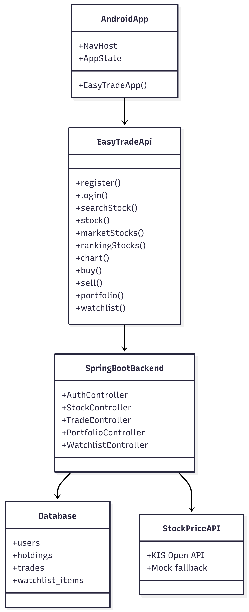

Android 앱은 사용자의 입력과 화면 전환을 담당하고, 모든 비즈니스 로직은 Spring Boot 백엔드에서 수행한다. 백엔드는 DB와 외부 주식 API를 사용하여 요청 결과를 계산하고 Android 앱에 JSON 형식으로 반환한다.

## 2.2 Backend Class Design

### 1) User

| Item | Design |
|---|---|
| Package | `com.easytrade.user` |
| Role | EasyTrade 사용자 계정 정보를 저장하는 entity |
| Main attributes | `id`, `name`, `email`, `password`, `nickname`, `balance`, `createdAt` |
| Main methods | `decreaseBalance(amount)`, `increaseBalance(amount)` |

`User`는 회원가입 시 생성된다. 기본 잔고는 10,000,000원이며, 매수 시 잔고가 감소하고 매도 시 잔고가 증가한다. 비밀번호는 Spring Security의 `PasswordEncoder`로 암호화하여 저장한다.

### 2) UserRepository

| Item | Design |
|---|---|
| Package | `com.easytrade.user` |
| Role | 사용자 조회 및 중복 이메일 검사를 담당하는 JPA repository |
| Main methods | `existsByEmail(email)`, `findByEmail(email)` |

### 3) AuthController

| Item | Design |
|---|---|
| Package | `com.easytrade.auth` |
| Role | 회원가입, 로그인, 내 정보 조회 API 제공 |
| Endpoints | `POST /api/auth/register`, `POST /api/auth/login`, `GET /api/auth/me` |

회원가입 요청을 받으면 이메일 중복 여부를 검사하고 사용자를 저장한다. 로그인 요청은 이메일과 비밀번호를 검증한 뒤 JWT를 발급한다.

### 4) JwtTokenProvider

| Item | Design |
|---|---|
| Package | `com.easytrade.auth` |
| Role | JWT 생성 및 검증 |
| Main methods | `createToken(email)`, `validateToken(token)`, `getSubject(token)` |

### 5) JwtAuthenticationFilter

| Item | Design |
|---|---|
| Package | `com.easytrade.auth` |
| Role | 요청 헤더의 JWT를 검증하고 Spring Security 인증 객체 생성 |

로그인/회원가입을 제외한 API는 JWT 인증이 필요하다.

### 6) StockPrice

| Item | Design |
|---|---|
| Package | `com.easytrade.stock` |
| Role | 주식 현재가 응답 모델 |
| Fields | `code`, `name`, `price`, `changeRate` |

### 7) StockPriceProvider

| Item | Design |
|---|---|
| Package | `com.easytrade.stock` |
| Role | 주식 현재가 조회 추상화 |
| Main methods | `findByCode(code)`, `search(query)`, `popularStocks()` |

KIS API와 mock provider를 동일한 인터페이스로 다루기 위한 설계이다.

### 8) KisStockPriceProvider

| Item | Design |
|---|---|
| Package | `com.easytrade.stock` |
| Role | 한국투자증권 Open API를 호출하여 국내 주식 현재가 조회 |
| Main API | `/uapi/domestic-stock/v1/quotations/inquire-price` |

`KIS_ENABLED=true`일 때 활성화된다. KIS API 호출이 실패하면 `FallbackStockPriceProvider`가 mock provider를 사용한다.

### 9) KisAccessTokenClient

| Item | Design |
|---|---|
| Package | `com.easytrade.stock` |
| Role | 한국투자증권 OAuth access token 발급 및 캐싱 |
| Main API | `/oauth2/tokenP` |

Access token은 만료 시점까지 재사용하고, 만료 전에 새로 발급받는다.

### 10) MockStockPriceProvider

| Item | Design |
|---|---|
| Package | `com.easytrade.stock` |
| Role | 개발 및 시연을 위한 임시 주식 가격 데이터 제공 |

KIS API 사용이 불가능하거나 요청이 실패할 때 fallback으로 사용한다.

### 11) FallbackStockPriceProvider

| Item | Design |
|---|---|
| Package | `com.easytrade.stock` |
| Role | KIS provider와 mock provider를 조합 |

KIS API가 정상 응답을 반환하면 KIS 데이터를 사용하고, 실패하면 mock 데이터를 사용한다.

### 12) KoreanStockCatalog

| Item | Design |
|---|---|
| Package | `com.easytrade.stock` |
| Role | 한국 시장 주요 종목 코드와 종목명 목록 관리 |
| Fields | `code`, `name` |

KIS 현재가 API가 종목명을 제공하지 않는 경우 종목명 보정을 위해 사용한다. 또한 `/api/stocks/market`과 `/api/stocks/ranking`의 기준 목록으로 사용한다.

### 13) StockController

| Item | Design |
|---|---|
| Package | `com.easytrade.stock` |
| Role | 주식 검색, 상세, 시장 목록, 랭킹 API 제공 |
| Endpoints | `GET /api/stocks/search`, `GET /api/stocks/{code}`, `GET /api/stocks/popular`, `GET /api/stocks/market`, `GET /api/stocks/ranking` |

### 14) StockChartController

| Item | Design |
|---|---|
| Package | `com.easytrade.stock` |
| Role | 주식 차트 데이터 API 제공 |
| Endpoint | `GET /api/stocks/{code}/chart?period=1D|1W|1M|3M` |

현재 구현은 KIS 현재가 기반으로 기간별 가격 포인트를 생성한다. 이후 KIS 기간별 시세 API로 확장 가능하도록 별도 controller로 분리한다.

### 15) Holding

| Item | Design |
|---|---|
| Package | `com.easytrade.holding` |
| Role | 사용자가 보유한 주식 종목 정보 |
| Main attributes | `user`, `stockCode`, `stockName`, `quantity`, `averagePrice` |
| Main methods | `buy(quantity, price)`, `sell(quantity)` |

매수 시 평균단가를 재계산하고, 매도 시 보유 수량을 감소시킨다.

### 16) Trade

| Item | Design |
|---|---|
| Package | `com.easytrade.trade` |
| Role | 매수/매도 거래 기록 |
| Main attributes | `user`, `type`, `stockCode`, `stockName`, `quantity`, `price`, `totalAmount`, `tradedAt` |

### 17) TradeService

| Item | Design |
|---|---|
| Package | `com.easytrade.trade` |
| Role | 매수/매도 비즈니스 로직 처리 |
| Main methods | `buy(user, stockCode, quantity)`, `sell(user, stockCode, quantity)` |

거래 처리는 `@Transactional`로 수행한다. 매수 시 잔고 부족 여부를 확인하고, 매도 시 보유 수량 부족 여부를 확인한다.

### 18) TradeController

| Item | Design |
|---|---|
| Package | `com.easytrade.trade` |
| Role | 매수, 매도, 거래내역 API 제공 |
| Endpoints | `POST /api/trades/buy`, `POST /api/trades/sell`, `GET /api/trades` |

### 19) PortfolioController

| Item | Design |
|---|---|
| Package | `com.easytrade.portfolio` |
| Role | 현금, 보유종목 평가금액, 총자산, 수익 계산 |
| Endpoint | `GET /api/portfolio` |

보유종목의 현재가는 `StockPriceProvider`를 통해 조회한다. 평균 매수가와 현재가를 비교하여 종목별 수익과 수익률을 계산한다.

### 20) WatchlistItem

| Item | Design |
|---|---|
| Package | `com.easytrade.watchlist` |
| Role | 사용자 관심종목 저장 entity |
| Main attributes | `user`, `stockCode`, `stockName`, `createdAt` |

사용자와 종목코드 조합은 unique constraint로 중복 저장을 방지한다.

### 21) WatchlistController

| Item | Design |
|---|---|
| Package | `com.easytrade.watchlist` |
| Role | 관심종목 조회, 추가, 삭제 API 제공 |
| Endpoints | `GET /api/watchlist`, `POST /api/watchlist/{stockCode}`, `DELETE /api/watchlist/{stockCode}` |

### Backend Class Diagram

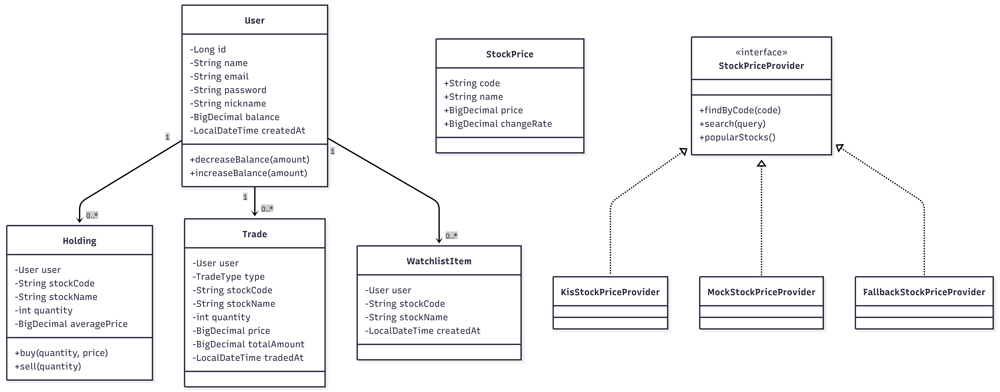

## 2.3 Android Class Design

### 1) MainActivity

| Item | Design |
|---|---|
| Package | `com.easytrade.mobile` |
| Role | Android 앱 entry point |
| Main method | `onCreate()` |

`MainActivity`는 `setContent`를 통해 Compose UI를 실행한다.

### 2) EasyTradeApi

| Item | Design |
|---|---|
| Role | Retrofit API interface |
| Main methods | `register`, `login`, `searchStock`, `stock`, `marketStocks`, `rankingStocks`, `chart`, `buy`, `sell`, `portfolio`, `watchlist` |

Android 앱이 백엔드 API와 통신하기 위한 interface이다.

### 3) ApiClient

| Item | Design |
|---|---|
| Role | Retrofit instance 생성 |
| Base URL | `http://10.0.2.2:8080/` |

Android Emulator에서 `10.0.2.2`는 host PC의 `localhost`를 의미한다.

### 4) AppState

| Item | Design |
|---|---|
| Role | Compose 화면 전체에서 공유하는 UI 상태 및 API 호출 로직 |
| Main states | `token`, `user`, `selectedStock`, `portfolio`, `chart`, `popularStocks`, `marketStocks`, `trades`, `watchlist`, `loading`, `message` |
| Main methods | `register`, `login`, `loadHome`, `search`, `loadStock`, `loadChart`, `buy`, `sell`, `loadPortfolio`, `loadTrades`, `loadWatchlist`, `toggleWatch` |

`AppState`는 화면과 API 호출 결과를 쉽게 사용할 수 있도록 상태를 저장한다.

### 5) Screen Composables

| Composable | Role |
|---|---|
| `LoginScreen` | 로그인 화면 |
| `RegisterScreen` | 회원가입 화면 |
| `HomeScreen` | 홈 화면, 잔고와 인기 종목 표시 |
| `SearchScreen` | 종목 검색 및 한국 시장 목록 표시 |
| `StockDetailScreen` | 현재가, 차트, 매수/매도/관심종목 버튼 표시 |
| `BuyScreen` | 매수 수량 입력 및 주문 |
| `SellScreen` | 매도 수량 입력 및 주문 |
| `PortfolioScreen` | 현금, 총자산, 보유종목 표시 |
| `WatchlistScreen` | 관심종목 목록 표시 |
| `RankingScreen` | 상승률, 하락률, 가격 기준 순위 표시 |
| `TradeHistoryScreen` | 거래내역 표시 |
| `ReturnScreen` | 전체 수익 및 수익률 분석 |

### Android Class Diagram

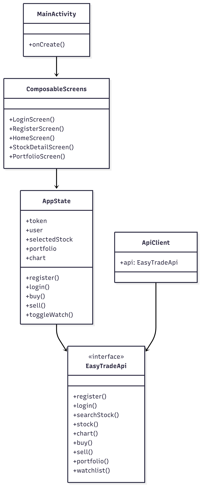

## 2.4 Database Design

### 1) users

| Column | Type | Constraint | Description |
|---|---|---|---|
| id | BIGINT | PK, auto increment | 사용자 ID |
| name | VARCHAR(50) | NOT NULL | 이름 |
| email | VARCHAR(100) | UNIQUE, NOT NULL | 이메일 |
| password | VARCHAR | NOT NULL | 암호화된 비밀번호 |
| nickname | VARCHAR(50) | NOT NULL | 닉네임 |
| balance | DECIMAL(15,2) | NOT NULL | 가상 현금 |
| created_at | DATETIME | NOT NULL | 가입 시각 |

### 2) holdings

| Column | Type | Constraint | Description |
|---|---|---|---|
| id | BIGINT | PK, auto increment | 보유종목 ID |
| user_id | BIGINT | FK | 사용자 ID |
| stock_code | VARCHAR(20) | NOT NULL | 종목코드 |
| stock_name | VARCHAR(100) | NOT NULL | 종목명 |
| quantity | INT | NOT NULL | 보유 수량 |
| average_price | DECIMAL(15,2) | NOT NULL | 평균 매수가 |

Unique constraint: `(user_id, stock_code)`

### 3) trades

| Column | Type | Constraint | Description |
|---|---|---|---|
| id | BIGINT | PK, auto increment | 거래 ID |
| user_id | BIGINT | FK | 사용자 ID |
| type | VARCHAR(10) | NOT NULL | BUY 또는 SELL |
| stock_code | VARCHAR(20) | NOT NULL | 종목코드 |
| stock_name | VARCHAR(100) | NOT NULL | 종목명 |
| quantity | INT | NOT NULL | 거래 수량 |
| price | DECIMAL(15,2) | NOT NULL | 거래 단가 |
| total_amount | DECIMAL(15,2) | NOT NULL | 총 거래 금액 |
| traded_at | DATETIME | NOT NULL | 거래 시각 |

### 4) watchlist_items

| Column | Type | Constraint | Description |
|---|---|---|---|
| id | BIGINT | PK, auto increment | 관심종목 ID |
| user_id | BIGINT | FK | 사용자 ID |
| stock_code | VARCHAR(20) | NOT NULL | 종목코드 |
| stock_name | VARCHAR(100) | NOT NULL | 종목명 |
| created_at | DATETIME | NOT NULL | 추가 시각 |

Unique constraint: `(user_id, stock_code)`

### ER Diagram

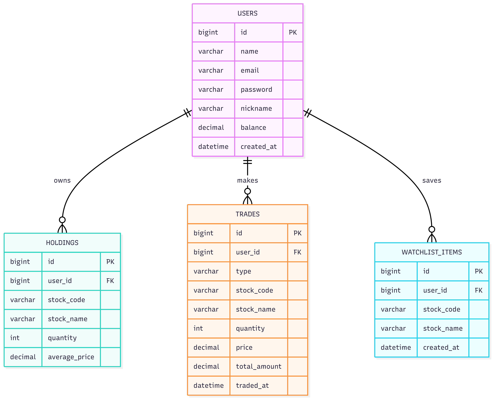

---

# 3. Sequence Diagram

## 3.1 Register

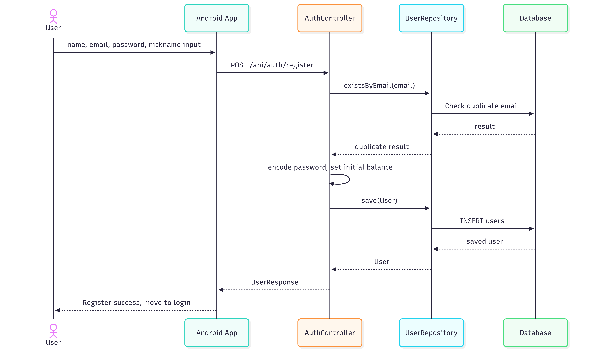

## 3.2 Login

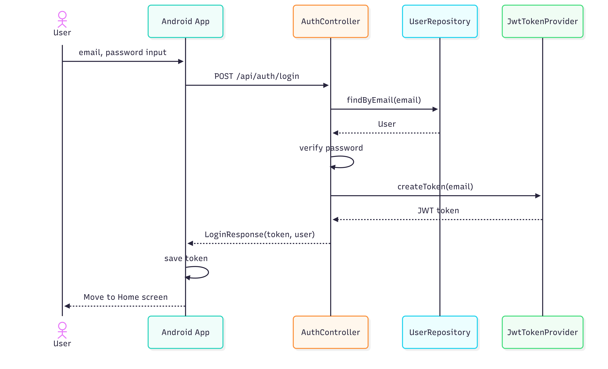

## 3.3 View Stock Price

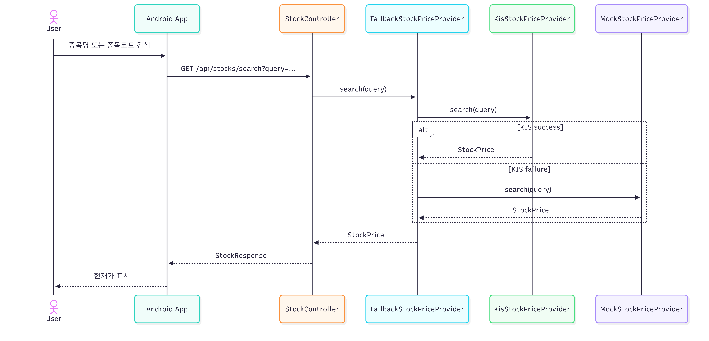

## 3.4 Buy Stock

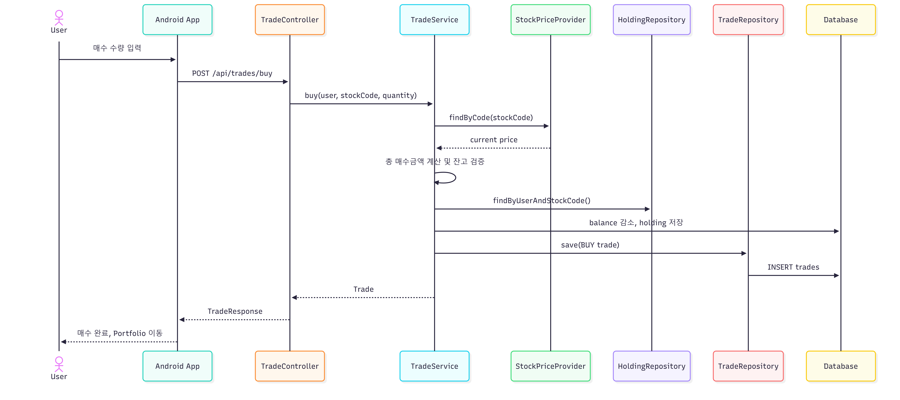

## 3.5 Sell Stock

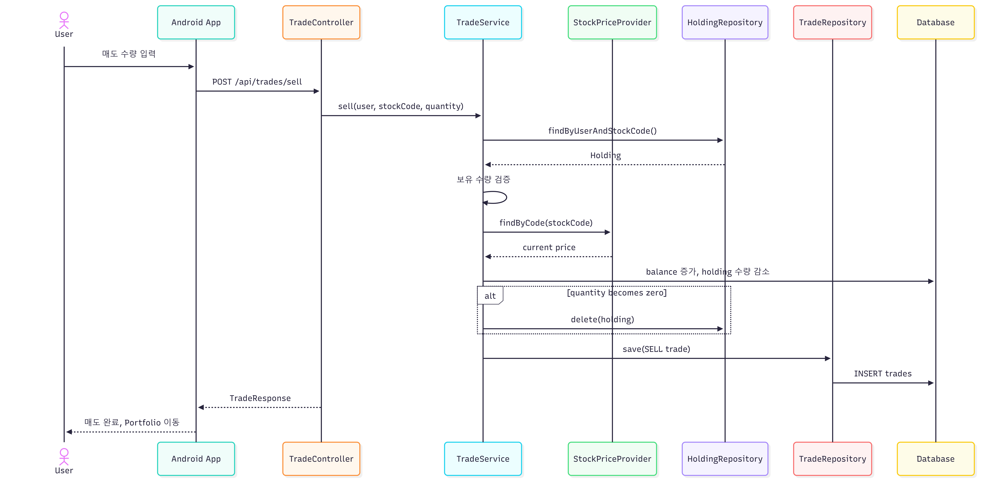

## 3.6 View Portfolio

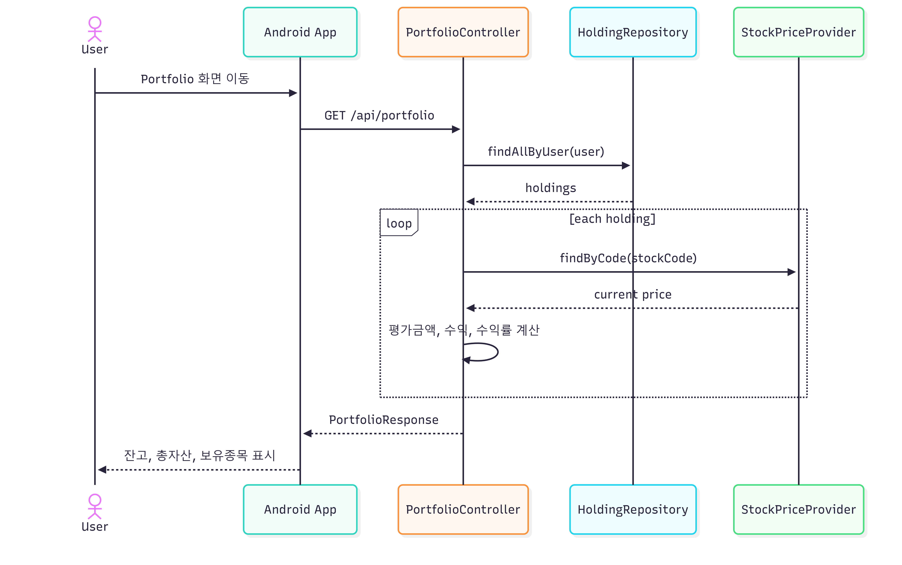

## 3.7 Manage Watchlist

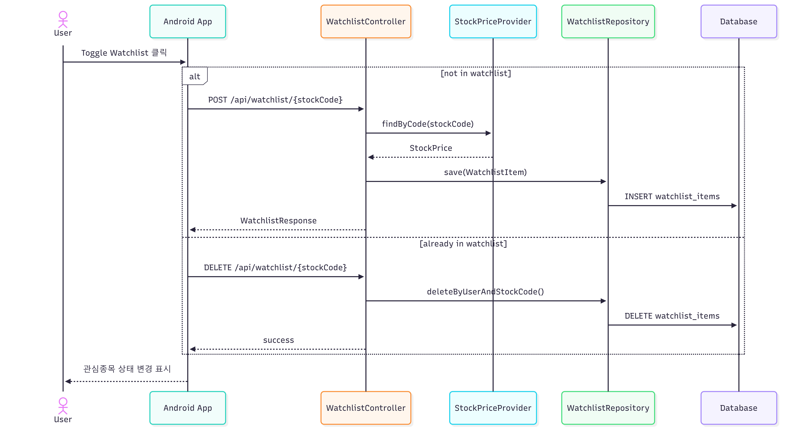

## 3.8 View Stock Ranking

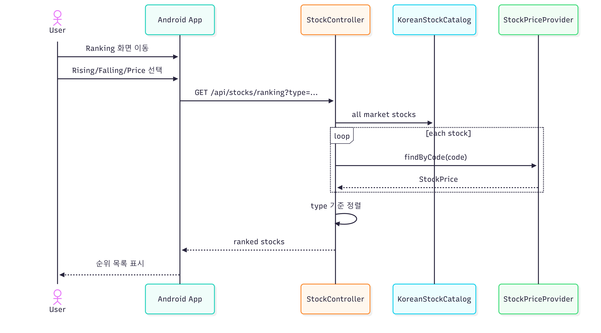

## 3.9 View Stock Chart

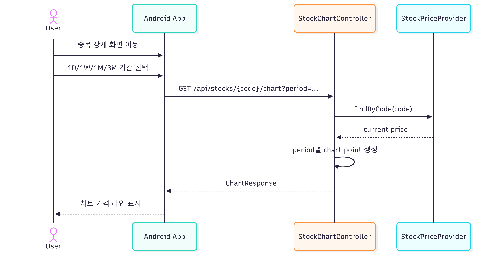

---

# 4. State Machine Diagram

## 4.1 User Session State

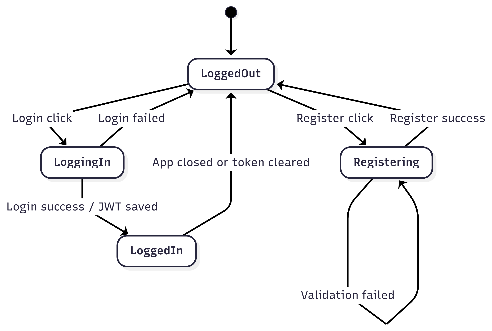

사용자는 기본적으로 로그인되지 않은 상태에서 시작한다. 회원가입 성공 후 로그인 화면으로 돌아가고, 로그인 성공 시 JWT가 저장되어 인증이 필요한 기능을 사용할 수 있다.

## 4.2 Trade State

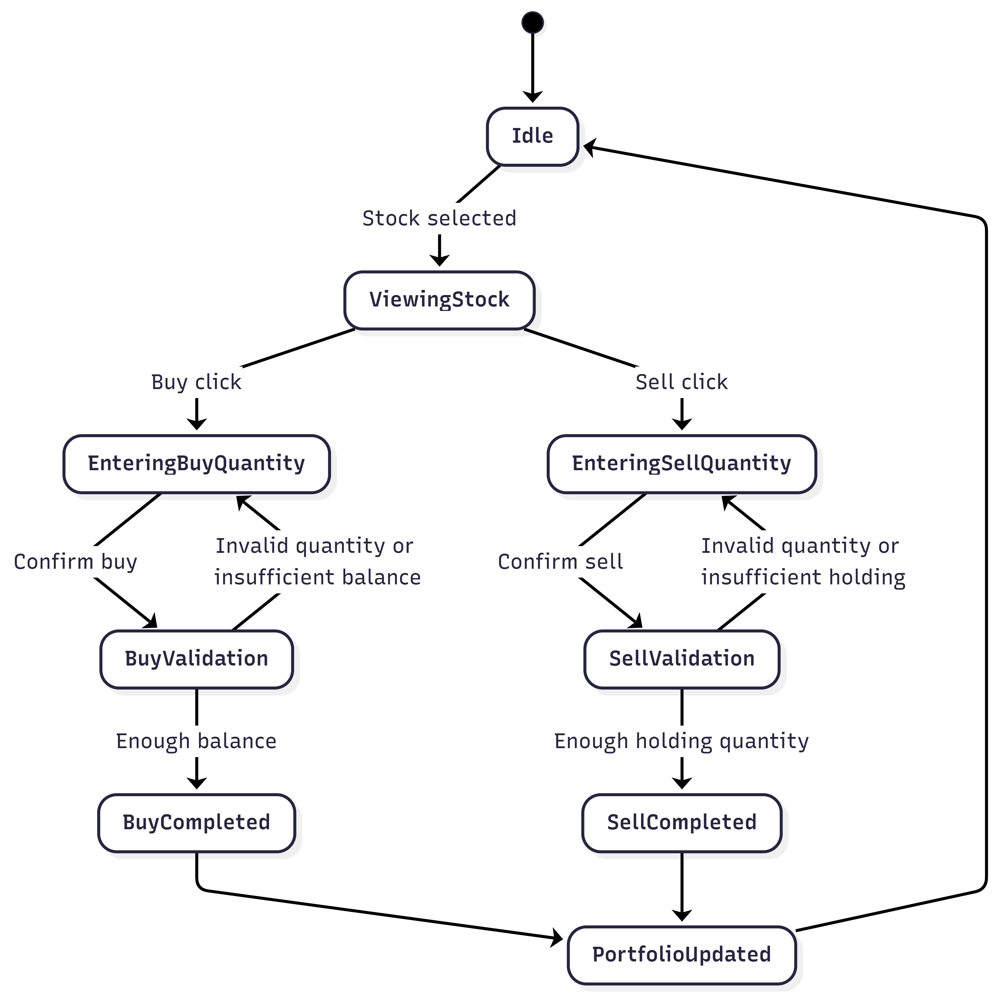

거래는 현재가 조회, 수량 입력, 유효성 검증, DB 업데이트, 포트폴리오 갱신 순서로 진행된다.

## 4.3 Watchlist State

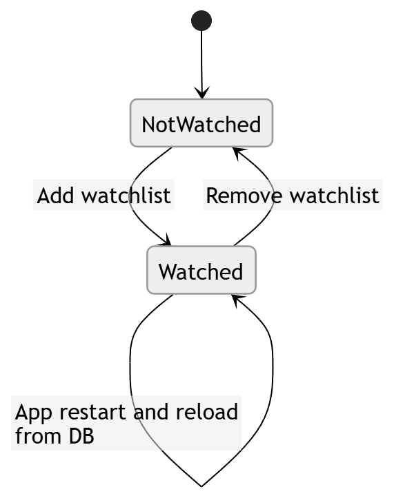

관심종목은 백엔드 DB에 저장되므로 앱 재시작 후에도 `GET /api/watchlist`를 통해 복원된다.

## 4.4 Stock Price Fetch State

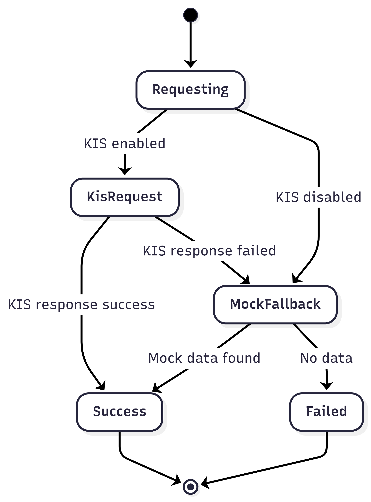

현재가 조회는 KIS API를 우선 사용한다. KIS API 호출이 실패하면 mock provider를 사용하여 개발 및 시연 안정성을 확보한다.

---

# 5. Implementation Requirements

## 5.1 Development Environment

| Area | Requirement |
|---|---|
| Backend language | Java 21 |
| Backend framework | Spring Boot 4.0.6 |
| Backend build tool | Gradle Wrapper |
| Android language | Kotlin |
| Android UI | Jetpack Compose |
| Android build | Android Gradle Plugin 8.7.3, Kotlin 2.0.21 |
| Database | MySQL for production-like setup, H2 file DB for local demo |
| Authentication | JWT |
| Stock API | Korea Investment & Securities Open API |

## 5.2 Backend Requirements

- Backend server must run on port `8080`.
- Local demo profile uses `application-local.yml`.
- H2 file database path is `backend/build/easytrade-local-db`.
- MySQL connection can be configured by `DB_URL`, `DB_USERNAME`, `DB_PASSWORD`.
- KIS API is enabled by `KIS_ENABLED=true`.
- KIS keys are supplied through backend runtime environment or `run-backend.ps1`.
- Passwords must be stored in encoded form.
- Buy and sell operations must be transactional.
- API error responses must return a message field through `GlobalExceptionHandler`.

## 5.3 Android Requirements

- Android app must be opened from the `android/` directory in Android Studio.
- Emulator backend URL is `http://10.0.2.2:8080/`.
- Physical device testing requires changing `API_BASE_URL` to the PC LAN IP.
- App requires Internet permission.
- App uses cleartext HTTP traffic for local backend testing.

## 5.4 API Requirements

| Function | Method | Endpoint | Auth |
|---|---|---|---|
| Register | POST | `/api/auth/register` | No |
| Login | POST | `/api/auth/login` | No |
| Me | GET | `/api/auth/me` | Yes |
| Search stock | GET | `/api/stocks/search?query={query}` | Yes |
| Stock detail | GET | `/api/stocks/{code}` | Yes |
| Popular stocks | GET | `/api/stocks/popular` | Yes |
| Market stocks | GET | `/api/stocks/market?query={query}&limit={limit}` | Yes |
| Ranking | GET | `/api/stocks/ranking?type={type}&limit={limit}` | Yes |
| Chart | GET | `/api/stocks/{code}/chart?period={period}` | Yes |
| Buy | POST | `/api/trades/buy` | Yes |
| Sell | POST | `/api/trades/sell` | Yes |
| Trade history | GET | `/api/trades` | Yes |
| Portfolio | GET | `/api/portfolio` | Yes |
| Watchlist list | GET | `/api/watchlist` | Yes |
| Watchlist add | POST | `/api/watchlist/{stockCode}` | Yes |
| Watchlist delete | DELETE | `/api/watchlist/{stockCode}` | Yes |

## 5.5 Data Validation Requirements

- Register request must include name, email, password, nickname.
- Email must be unique.
- Login request must include email and password.
- Trade quantity must be greater than or equal to 1.
- Buy request must fail if cash balance is insufficient.
- Sell request must fail if holding quantity is insufficient.
- Stock search query must not be blank.
- Watchlist must not store duplicate `(user, stockCode)` values.

## 5.6 Non-functional Requirements

- Basic API response time should be within 3 to 5 seconds under local demo conditions.
- System must remain usable if KIS API fails by using fallback stock data.
- JWT secret should be changed for production use.
- KIS AppKey/AppSecret should not be stored inside the Android APK.
- Local demo uses H2 for stability, but database schema is designed to be compatible with MySQL.

---

# 6. Glossary

| Term | Description |
|---|---|
| EasyTrade | 가상자금을 이용하여 국내 주식 거래를 연습하는 모의 주식거래 앱 |
| User | EasyTrade에 가입하여 주식 조회, 매수, 매도, 포트폴리오 기능을 사용하는 사용자 |
| JWT | 로그인 후 인증된 API 요청을 위해 사용하는 JSON Web Token |
| Stock | 거래 대상이 되는 주식 종목 |
| Stock Code | 한국 주식 종목을 구분하는 6자리 코드 |
| Current Price | 외부 주식 API에서 조회한 현재 주식 가격 |
| KIS API | 한국투자증권 Open API |
| Mock Provider | KIS API 실패 또는 비활성화 시 사용하는 임시 주식 데이터 제공자 |
| Holding | 사용자가 매수하여 보유 중인 주식 |
| Average Price | 같은 종목을 여러 번 매수했을 때 계산하는 평균 매수가 |
| Trade | 사용자의 매수 또는 매도 기록 |
| Portfolio | 현금, 보유종목, 평가금액, 총자산, 수익을 모아 보여주는 자산 현황 |
| Watchlist | 사용자가 관심 있게 추적하는 주식 종목 목록 |
| Ranking | 상승률, 하락률, 가격 기준으로 정렬한 주식 목록 |
| Chart | 특정 종목의 기간별 가격 흐름을 보여주는 데이터 |
| H2 local DB | 로컬 개발 및 시연을 위한 파일 기반 데이터베이스 |
| MySQL | 실제 운영 또는 production-like 환경에서 사용할 수 있는 관계형 데이터베이스 |

---

# 7. References

1. Korea Investment & Securities Open API, https://apiportal.koreainvestment.com
2. Spring Boot Documentation, https://spring.io/projects/spring-boot
3. Android Developers - Jetpack Compose, https://developer.android.com/compose
4. Retrofit, https://square.github.io/retrofit
5. Gradle User Manual, https://docs.gradle.org
